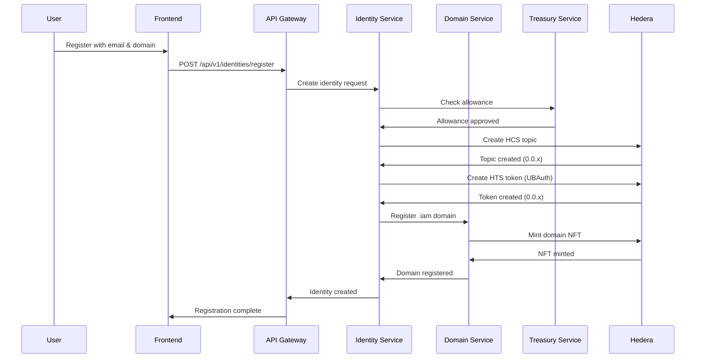
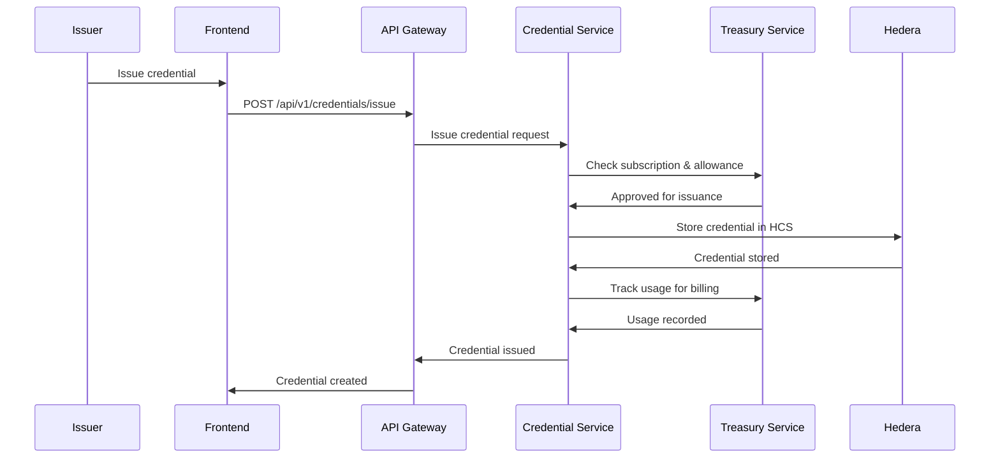

# UBeU System Architecture

## Overview

UBeU is built as a modern, scalable microservices architecture designed to handle the complexities of decentralized identity management while maintaining Web2-level simplicity for end users. The system leverages Hedera's high-performance distributed ledger technology with a robust PostgreSQL backend for operational data.

## Core Principles

### 1. Backend-First Design
- **Rich Business Logic**: Complex operations handled server-side
- **Smart Contracts as Data Layer**: Blockchain used for immutable storage and consensus
- **API Abstraction**: Web3 complexity hidden behind familiar REST APIs

### 2. Treasury Sponsorship Model
- **Zero User Cryptocurrency**: All network fees sponsored by platform
- **Predictable Costs**: Fixed USD-denominated pricing
- **Scalable Economics**: Volume-based discounts for enterprise users

### 3. Standards Compliance
- **W3C DID**: Decentralized Identifier standard
- **OpenID4VCI/VP**: Universal credential issuance and presentation
- **IMS Open Badges**: Educational credential standard

## System Components

### Frontend Layer

```
┌─────────────────────────────────────────────────────────────┐
│                        Frontend Layer                       │
│  ┌─────────────────┐ ┌─────────────────┐ ┌─────────────────┐ │
│  │   Web App       │ │   Mobile App    │ │   Admin Panel   │ │
│  │                 │ │                 │ │                 │ │
│  │ • Next.js 14    │ │ • React Native  │ │ • Dashboard     │ │
│  │ • PWA Support   │ │ • Wallet Connect│ │ • Analytics     │ │
│  │ • TypeScript    │ │ • Biometric Auth│ │ • Real-time     │ │
│  └─────────────────┘ └─────────────────┘ └─────────────────┘ │
└─────────────────────────────────────────────────────────────┘
```

#### Web Application
- **Framework**: Next.js 14 with App Router
- **Styling**: Tailwind CSS with custom design system
- **State Management**: Zustand for client state
- **UI Components**: Radix UI primitives with custom theming
- **Features**:
  - Progressive Web App (PWA) support
  - Offline capability for critical functions
  - Responsive design for all devices
  - Accessibility compliance (WCAG 2.1 AA)

#### Mobile Application
- **Framework**: React Native with Expo
- **Features**:
  - WalletConnect integration
  - Biometric authentication
  - Push notifications
  - QR code scanning for credential sharing

#### Admin Panel
- **Purpose**: Enterprise credential issuer management
- **Features**:
  - Bulk credential issuance
  - Analytics and reporting
  - API key management
  - User access controls

### API Gateway Layer

```
┌─────────────────────────────────────────────────────────────┐
│                     API Gateway Layer                       │
│  ┌─────────────────┐ ┌─────────────────┐ ┌─────────────────┐ │
│  │ API Gateway     │ │ Microservices   │ │   Database      │ │
│  │                 │ │                 │ │                 │ │
│  │ • Fastify       │ │ • Identity Mgmt │ │ • PostgreSQL    │ │
│  │ • Rate Limiting │ │ • Domain Verif. │ │ • Redis Cache   │ │
│  │ • Authentication│ │ • Treasury      │ │ • Audit Logs    │ │
│  └─────────────────┘ └─────────────────┘ └─────────────────┘ │
└─────────────────────────────────────────────────────────────┘
```

#### API Gateway
- **Framework**: Fastify with TypeScript
- **Features**:
  - RESTful API design
  - OpenAPI 3.0 specification
  - JWT authentication with refresh tokens
  - Advanced rate limiting with Redis
  - Request/response logging
  - CORS handling
  - Input validation with Zod
  - Error handling and standardization

#### Microservices Architecture

##### Identity Service
- **Purpose**: DID lifecycle management
- **Features**:
  - DID creation, resolution, and updates
  - Multi-DID single-topic architecture
  - User limits and rate limiting
  - PostgreSQL-backed storage
  - HCS-1 compression for DID documents

##### Domain Verification Service
- **Purpose**: Multi-blockchain domain ownership verification
- **Features**:
  - Native .iam domain registration
  - External domain verification (.eth, .crypto, .sol)
  - DNS verification for enterprises
  - Blockchain registry integration
  - Domain NFT minting via HTS

##### Treasury Service
- **Purpose**: Network fee sponsorship and billing
- **Features**:
  - Unlimited treasury sponsorship
  - USD/HBAR exchange rate management
  - Network spend tracking per user
  - Payment processing integration
  - Cost analytics and reporting

##### Credential Service
- **Purpose**: W3C Verifiable Credential management
- **Features**:
  - OpenID4VCI protocol implementation
  - OpenID4VP protocol implementation
  - Treasury-sponsored operations
  - Bulk issuance capabilities
  - Credential verification and validation

##### User Limits Service
- **Purpose**: Advanced rate limiting and usage control
- **Features**:
  - Static limits per tier
  - Rate limiting per endpoint
  - Usage tracking and analytics
  - Anti-abuse protection
  - Dynamic limit adjustments

### Blockchain Layer

```
┌─────────────────────────────────────────────────────────────┐
│                 Hedera Network Layer                        │
│  ┌─────────────────┐ ┌─────────────────┐ ┌─────────────────┐ │
│  │ Smart Contracts │ │   HCS Topics    │ │   HTS Tokens    │ │
│  │                 │ │                 │ │                 │ │
│  │ • Data Storage  │ │ • DID Documents │ │ • UBAuth Tokens │ │
│  │ • Final         │ │ • Audit Trails  │ │ • Domain NFTs   │ │
│  │   Settlement    │ │ • Event Logs    │ └─────────────────┘ │
│  └─────────────────┘ └─────────────────┘                     │
└─────────────────────────────────────────────────────────────┘
```

#### Hedera Consensus Service (HCS)
- **Purpose**: Immutable document storage and consensus
- **Features**:
  - DID document storage with HCS-1 compression
  - Multi-DID single-topic architecture
  - Audit trails for all operations
  - Event logging for analytics
  - Consensus timestamp ordering

#### Hedera Token Service (HTS)
- **Purpose**: Native token operations
- **Features**:
  - UBAuth identity tokens (non-transferable)
  - Domain NFT minting and management
  - Treasury account management
  - Token association and transfers
  - Custom token properties

#### Smart Contracts
- **Purpose**: Complex business logic execution
- **Features**:
  - Domain NFT contracts
  - Treasury management contracts
  - Credential verification contracts
  - Multi-signature operations
  - Upgradeable proxy patterns

## Data Architecture

### PostgreSQL Schema

```sql
-- Core entities
CREATE TABLE users (
  id UUID PRIMARY KEY,
  email VARCHAR(255) UNIQUE NOT NULL,
  created_at TIMESTAMP DEFAULT CURRENT_TIMESTAMP,
  updated_at TIMESTAMP DEFAULT CURRENT_TIMESTAMP
);

CREATE TABLE subscriptions (
  id UUID PRIMARY KEY,
  user_id UUID REFERENCES users(id),
  tier VARCHAR(50) NOT NULL,
  status VARCHAR(50) NOT NULL,
  monthly_fixed_fee DECIMAL(10,2) DEFAULT 0,
  credential_fee_per_unit DECIMAL(10,4) DEFAULT 0,
  setup_fee DECIMAL(10,2) DEFAULT 0,
  setup_fee_paid BOOLEAN DEFAULT FALSE,
  current_month_credential_count INTEGER DEFAULT 0,
  monthly_credential_limit INTEGER DEFAULT -1,
  volume_discount_rate DECIMAL(5,4) DEFAULT 0,
  current_period_start TIMESTAMP,
  next_billing_date TIMESTAMP,
  created_at TIMESTAMP DEFAULT CURRENT_TIMESTAMP,
  updated_at TIMESTAMP DEFAULT CURRENT_TIMESTAMP
);

CREATE TABLE domains (
  id UUID PRIMARY KEY,
  user_id UUID REFERENCES users(id),
  domain_name VARCHAR(255) UNIQUE NOT NULL,
  domain_type VARCHAR(50) NOT NULL,
  blockchain_network VARCHAR(50),
  nft_token_id VARCHAR(100),
  status VARCHAR(50) NOT NULL,
  verification_proof JSONB,
  registered_at TIMESTAMP,
  expires_at TIMESTAMP,
  created_at TIMESTAMP DEFAULT CURRENT_TIMESTAMP
);

CREATE TABLE credentials (
  id VARCHAR(255) PRIMARY KEY,
  subject_did VARCHAR(255) NOT NULL,
  issuer_did VARCHAR(255) NOT NULL,
  type VARCHAR(100) NOT NULL,
  status VARCHAR(50) NOT NULL,
  claims JSONB NOT NULL,
  proof JSONB,
  issued_at TIMESTAMP NOT NULL,
  expires_at TIMESTAMP,
  revoked_at TIMESTAMP,
  revocation_reason TEXT,
  created_at TIMESTAMP DEFAULT CURRENT_TIMESTAMP
);

-- Indexes for performance
CREATE INDEX idx_subscriptions_user_id ON subscriptions(user_id);
CREATE INDEX idx_subscriptions_status ON subscriptions(status);
CREATE INDEX idx_domains_user_id ON domains(user_id);
CREATE INDEX idx_domains_domain_name ON domains(domain_name);
CREATE INDEX idx_credentials_subject_did ON credentials(subject_did);
CREATE INDEX idx_credentials_issuer_did ON credentials(issuer_did);
CREATE INDEX idx_credentials_status ON credentials(status);
```

### Redis Cache Strategy

```javascript
// Cache keys structure
const CACHE_KEYS = {
  // User data
  user: (userId) => `user:${userId}`,
  userLimits: (userId) => `user:${userId}:limits`,

  // DID resolution
  did: (did) => `did:${did}`,
  didDocument: (did) => `did:${did}:document`,

  // Domain verification
  domain: (domain) => `domain:${domain}`,
  domainVerification: (domain) => `domain:${domain}:verification`,

  // Rate limiting
  rateLimit: (key) => `ratelimit:${key}`,

  // Session management
  session: (sessionId) => `session:${sessionId}`,
  userSession: (userId) => `user:${userId}:session`,

  // Analytics
  analytics: (type, period) => `analytics:${type}:${period}`,
  metrics: (service, metric) => `metrics:${service}:${metric}`
};

// Cache TTL values
const CACHE_TTL = {
  user: 3600,        // 1 hour
  did: 7200,         // 2 hours
  domain: 1800,      // 30 minutes
  session: 86400,    // 24 hours
  analytics: 300,    // 5 minutes
  rateLimit: 60      // 1 minute
};
```

## Service Interactions

### Identity Creation Flow



### Credential Issuance Flow



## Scalability Considerations

### Horizontal Scaling

#### API Gateway Layer
- **Load Balancing**: Nginx or AWS ALB for request distribution
- **Auto Scaling**: Kubernetes HPA based on CPU/memory metrics
- **Circuit Breakers**: Resilience patterns for service failures
- **Rate Limiting**: Distributed Redis-backed rate limiting

#### Service Layer
- **Microservices**: Independent scaling per service
- **Database Sharding**: PostgreSQL sharding for large datasets
- **Cache Distribution**: Redis cluster for high availability
- **Message Queues**: Kafka for asynchronous processing

#### Blockchain Layer
- **Multi-Topic Architecture**: Parallel HCS topics for performance
- **Batch Processing**: Bulk operations for efficiency
- **Network Optimization**: Mirror node caching for reads

### Performance Optimization

#### Database Optimization
```sql
-- Partitioning strategy
CREATE TABLE credentials_y2025m01 PARTITION OF credentials
    FOR VALUES FROM ('2025-01-01') TO ('2025-02-01');

-- Query optimization
CREATE INDEX CONCURRENTLY idx_credentials_subject_did_date
ON credentials(subject_did, issued_at DESC);

-- Materialized views for analytics
CREATE MATERIALIZED VIEW monthly_usage AS
SELECT
    user_id,
    DATE_TRUNC('month', issued_at) as month,
    COUNT(*) as credential_count,
    SUM(cost) as total_cost
FROM credentials
GROUP BY user_id, DATE_TRUNC('month', issued_at);
```

#### Caching Strategy
```javascript
// Multi-level caching
const cacheStrategy = {
  // L1: In-memory (service level)
  l1Cache: new Map(),

  // L2: Redis (distributed)
  l2Cache: redisClient,

  // L3: CDN (static assets)
  cdnCache: 'https://cdn.ubeu.io'
};

// Cache warming
async function warmCache() {
  // Preload frequently accessed DIDs
  const popularDids = await getPopularDids();
  for (const did of popularDids) {
    await cacheDidDocument(did);
  }
}
```

### Monitoring and Observability

#### Application Metrics
```javascript
// Prometheus metrics
const metrics = {
  // HTTP metrics
  httpRequestsTotal: new Counter('http_requests_total', 'Total HTTP requests'),
  httpRequestDuration: new Histogram('http_request_duration_seconds', 'HTTP request duration'),

  // Business metrics
  credentialsIssuedTotal: new Counter('credentials_issued_total', 'Total credentials issued'),
  domainsRegisteredTotal: new Counter('domains_registered_total', 'Total domains registered'),

  // System metrics
  activeConnections: new Gauge('active_connections', 'Active connections'),
  queueSize: new Gauge('queue_size', 'Queue size'),

  // Blockchain metrics
  hederaTransactionsTotal: new Counter('hedera_transactions_total', 'Total Hedera transactions'),
  hederaTransactionErrors: new Counter('hedera_transaction_errors', 'Hedera transaction errors')
};
```

#### Logging Strategy
```javascript
// Structured logging
const logger = winston.createLogger({
  level: process.env.LOG_LEVEL || 'info',
  format: winston.format.combine(
    winston.format.timestamp(),
    winston.format.errors({ stack: true }),
    winston.format.json()
  ),
  transports: [
    new winston.transports.File({ filename: 'logs/error.log', level: 'error' }),
    new winston.transports.File({ filename: 'logs/combined.log' }),
    new winston.transports.Console({
      format: winston.format.combine(
        winston.format.colorize(),
        winston.format.simple()
      )
    })
  ]
});
```

## Security Architecture

### Authentication & Authorization
- **JWT Tokens**: Stateless authentication with refresh tokens
- **Role-Based Access**: User, Enterprise, Admin roles
- **API Keys**: For enterprise integrations
- **Multi-Factor Authentication**: TOTP and biometric options

### Data Protection
- **Encryption at Rest**: AES-256-GCM for sensitive data
- **Encryption in Transit**: TLS 1.3 for all communications
- **Key Management**: Hardware Security Modules (HSM)
- **Data Minimization**: GDPR-compliant data collection

### Network Security
- **Web Application Firewall**: Cloudflare or AWS WAF
- **DDoS Protection**: Rate limiting and traffic analysis
- **API Gateway Security**: Request validation and sanitization
- **Zero Trust**: Every request authenticated and authorized

## Deployment Architecture

### Development Environment
```yaml
# docker-compose.dev.yml
version: '3.8'
services:
  api-gateway:
    build: ./packages/api-gateway
    ports:
      - "3000:3000"
    environment:
      - NODE_ENV=development
    depends_on:
      - postgres
      - redis

  postgres:
    image: postgres:15
    environment:
      POSTGRES_DB: ubeu_dev
      POSTGRES_USER: ubeu
      POSTGRES_PASSWORD: password

  redis:
    image: redis:7-alpine
```

### Production Environment
```yaml
# Kubernetes production deployment
apiVersion: apps/v1
kind: Deployment
metadata:
  name: ubeu-api-gateway
spec:
  replicas: 3
  selector:
    matchLabels:
      app: ubeu-api-gateway
  template:
    metadata:
      labels:
        app: ubeu-api-gateway
    spec:
      containers:
      - name: api-gateway
        image: ubeu/api-gateway:latest
        ports:
        - containerPort: 3000
        env:
        - name: NODE_ENV
          value: production
        resources:
          requests:
            memory: "512Mi"
            cpu: "250m"
          limits:
            memory: "1Gi"
            cpu: "500m"
```

## Disaster Recovery

### Backup Strategy
- **Database Backups**: Daily full backups, hourly incremental
- **Blockchain Data**: Mirror node synchronization
- **Configuration**: Git-based configuration management
- **Secrets**: Encrypted secret management

### High Availability
- **Multi-Region Deployment**: Active-active across regions
- **Database Replication**: PostgreSQL streaming replication
- **Load Balancing**: Global load balancing with health checks
- **Circuit Breakers**: Automatic failover for service degradation

## Future Considerations

### Scalability Roadmap
- **Edge Computing**: Global edge deployment for performance
- **Microservices Decomposition**: Further service splitting
- **Event-Driven Architecture**: Kafka-based event streaming
- **AI/ML Integration**: Predictive scaling and anomaly detection

### Technology Evolution
- **Web3 Integration**: Enhanced wallet connectivity
- **Zero-Knowledge Proofs**: Privacy-preserving credentials
- **Cross-Chain Support**: Multi-blockchain domain verification
- **IoT Integration**: Device identity management

This architecture provides a solid foundation for UBeU's growth from MVP to enterprise-scale platform while maintaining the simplicity and security that users expect from a Web2-familiar identity service.